# Chop First — UML Diagrams

## 1. Structural Diagrams

### 1.1 Class Diagram — Core Domain Model

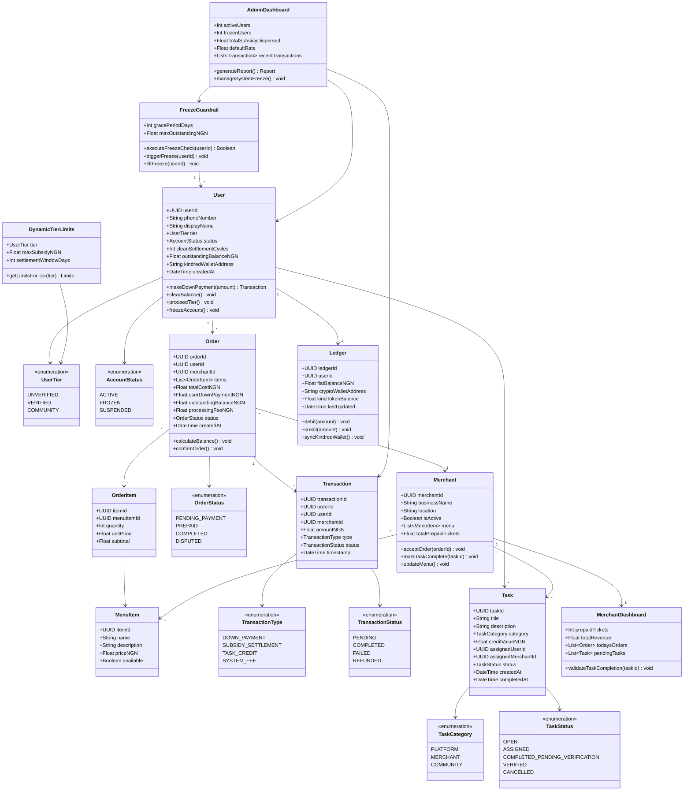

### 1.2 Component Diagram — System Architecture

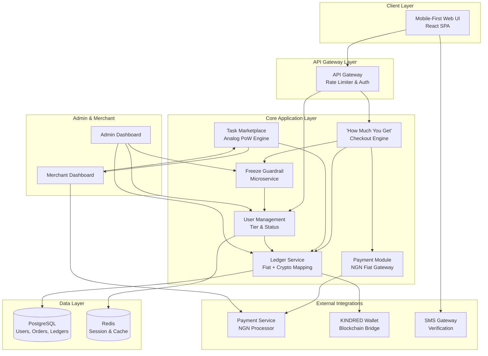

### 1.3 Deployment Diagram — Infrastructure Topology

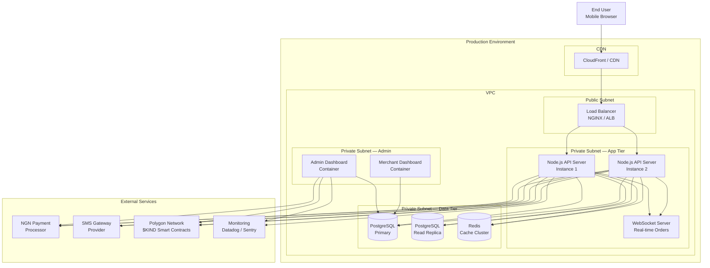

### 1.4 Package / Module Diagram

```mermaid
graph TB
    subgraph "com.chopfirst"
        subgraph "domain"
            U[User]
            O[Order]
            M[Merchant]
            T[Transaction]
            L[Ledger]
            TK[Task]
            ML[MenuItem]
        end

        subgraph "service"
            CS[CheckoutService]
            PS[PaymentService]
            TS[TaskService]
            FS[FreezeService]
            US[UserService]
            LS[LedgerService]
        end

        subgraph "repository"
            UR[UserRepository]
            OR[OrderRepository]
            MR[MerchantRepository]
            TR[TransactionRepository]
            LR[LedgerRepository]
            TKR[TaskRepository]
        end

        subgraph "controller"
            CC[CheckoutController]
            UC[UserController]
            MC[MerchantController]
            TC[TaskController]
            AC[AdminController]
        end

        subgraph "dto"
            OrderDTO
            UserDTO
            PaymentDTO
            TaskDTO
            LedgerDTO
        end

        subgraph "config"
            AppConfig
            SecurityConfig
            PaymentGatewayConfig
            BlockchainConfig
        end

        subgraph "external"
            NGN_PAY[NGN Payment Gateway]
            KINDRED_WALLET[KINDRED Wallet<br/>Bridge]
            SMS_PROV[SMS Provider]
        end

        controller --> service
        service --> domain
        service --> repository
        service --> external
        controller --> dto
        repository --> domain
        config --> service
    end
```

---

## 2. Behavioural Diagrams

### 2.1 Use Case Diagram — Actors & Features

```mermaid
graph TB
    subgraph "Chop First System"
        UC1("Place Food Order<br/>(Partial Payment)")
        UC2("Make Down Payment")
        UC3("View Outstanding Balance")
        UC4("Clear Balance via Naira")
        UC5("Browse & Complete Tasks<br/>(Analog PoW)")
        UC6("Clear Balance via Task Credit")
        UC7("View Tier & Limits")
        UC8("Progress to Next Tier")

        UC9("Accept Prepaid Ticket")
        UC10("Manage Menu & Availability")
        UC11("Validate Community Tasks")

        UC12("View System Metrics")
        UC13("Manage Freeze Guardrails")
        UC14("Process Manual Credits")
        UC15("Generate Reports")

        UC16("Authenticate & Onboard")
        UC17("Link KINDRED Wallet")
    end

    User[End User / Seeker] --> UC1
    User --> UC2
    User --> UC3
    User --> UC4
    User --> UC5
    User --> UC6
    User --> UC7
    User --> UC8
    User --> UC16
    User --> UC17

    Merchant[Restaurant / Vendor] --> UC9
    Merchant --> UC10
    Merchant --> UC11
    Merchant --> UC16

    Admin[Platform Administrator] --> UC12
    Admin --> UC13
    Admin --> UC14
    Admin --> UC15
    Admin --> UC16
```

### 2.2 Sequence Diagram — Place Order with Partial Payment

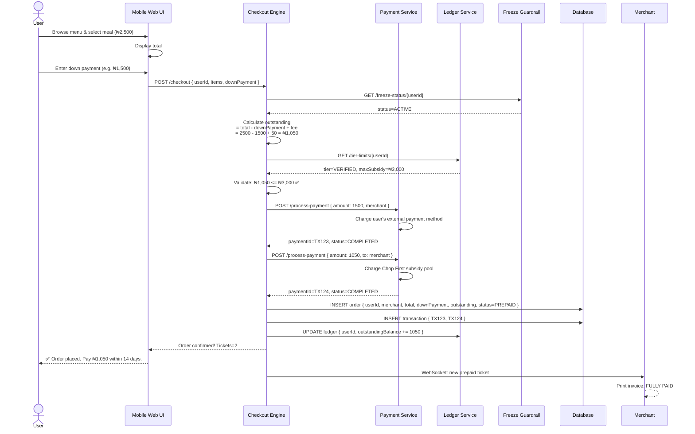

### 2.3 Sequence Diagram — Clear Balance via Analog PoW Task

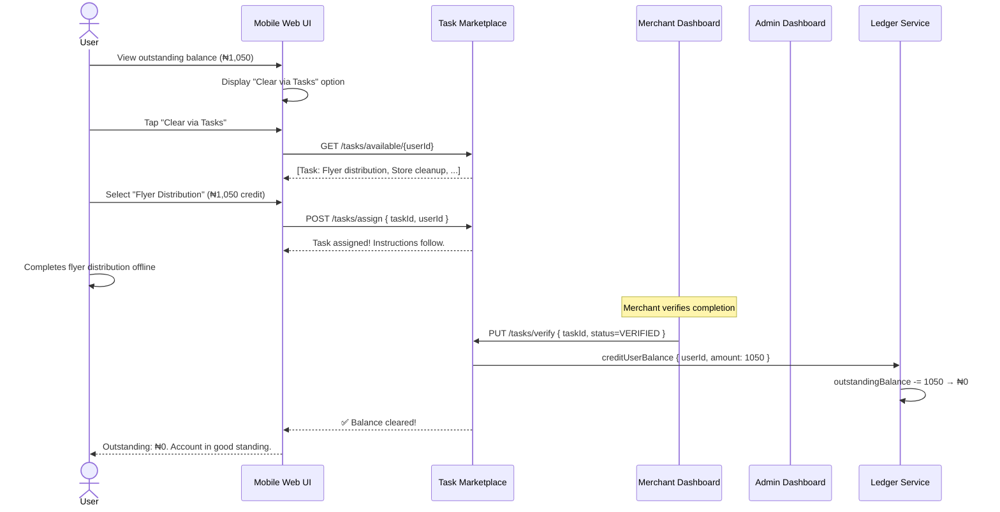

### 2.4 Activity Diagram — Order & Settlement Flow

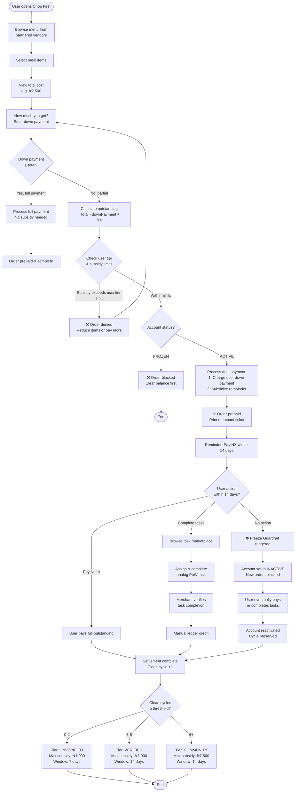

### 2.5 State Machine Diagram — User Account Lifecycle

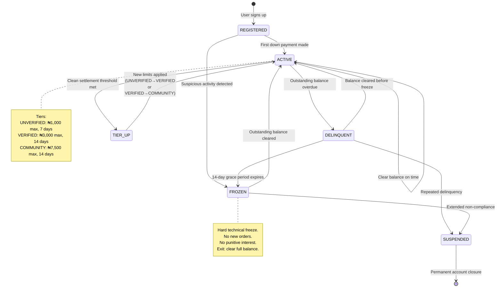

### 2.6 Sequence Diagram — Freeze Guardrail Trigger & Recovery

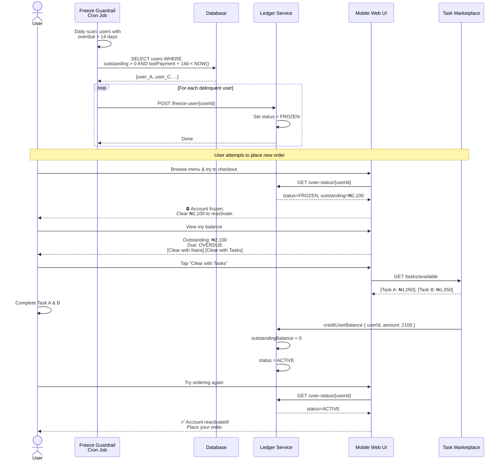

### 2.7 Communication Diagram — Order Processing (Object Interaction)

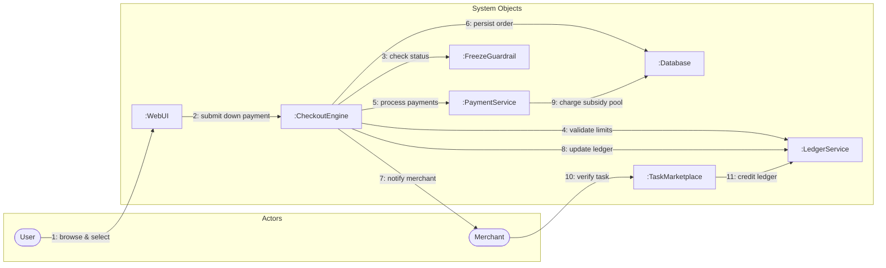

### 2.8 Use Case Diagram — Merchant & Admin Operations

```mermaid
graph TB
    subgraph "Chop First — Merchant"
        M_Incoming[View Incoming<br/>Prepaid Tickets]
        M_Menu[Toggle Menu<br/>Item Availability]
        M_History[View Order<br/>History & Revenue]
        M_Tasks[View & Verify<br/>Community Tasks]
        M_Profile[Manage<br/>Business Profile]
    end

    subgraph "Chop First — Admin"
        A_Metrics[View Platform<br/>Metrics Dashboard]
        A_Users[Manage Users<br/>& Account Status]
        A_Freeze[Manual Freeze /<br/>Unfreeze Override]
        A_Tiers[Adjust Tier<br/>Limit Configurations]
        A_Tasks[Create / Remove<br/>Platform Tasks]
        A_Credit[Process Manual<br/>Ledger Credits]
        A_Reports[Generate<br/>Settlement Reports]
        A_Integrate[Manage KINDRED<br/>Wallet Integration]
    end

    Merchant[<b>Merchant</b><br/>Vendor/Restaurant] --> M_Incoming
    Merchant --> M_Menu
    Merchant --> M_History
    Merchant --> M_Tasks
    Merchant --> M_Profile

    Admin[<b>Admin</b><br/>Platform Operator] --> A_Metrics
    Admin --> A_Users
    Admin --> A_Freeze
    Admin --> A_Tiers
    Admin --> A_Tasks
    Admin --> A_Credit
    Admin --> A_Reports
    Admin --> A_Integrate
```

---

## 3. Legend

| Icon/Notation | Meaning |
|---|---|
| `-->` | Dependency / Association |
| `-->>` | Async return / Callback |
| `--*` | Composition |
| `--o` | Aggregation |
| `<<enumeration>>` | Enum type |
| `[*]` | Initial / Final state |
| `@` | Actor (external entity) |
